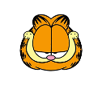

# GARF : Gaussian Activated Radiance Fields for High Fidelity Reconstruction \& Pose Estimation

### [Project Page](https://sfchng.github.io/garf/) | [arXiv preprint](https://arxiv.org/abs/2204.05735) | [Paper](https://www.ecva.net/papers/eccv_2022/papers_ECCV/papers/136930259.pdf) | [Colab Notebook](https://colab.research.google.com/drive/1OFOXP02KeG7ovVaCnRg80fMvV8ZyOKY-?usp=share_link)

[Shin-Fang Chng ¹](https://sfchng.github.io), 
[Sameera Ramasinghe ²](https://lk.linkedin.com/in/sameeraramasinghe?original_referer=https%3A%2F%2Fwww.google.com%2F), 
[Jamie Sherrah  ¹](https://au.linkedin.com/in/jsherrah?original_referer=https%3A%2F%2Fwww.google.com%2F), 
[Simon Lucey    ¹](https://www.ri.cmu.edu/ri-people/simon-lucey/).

[¹  Australian Institute for Machine Learning (AIML), University of Adelaide](https://www.adelaide.edu.au/aiml/), 
[²  Amazon, Australia]() 

--------------------------------------
## Overview 
We provide the PyTorch implementation for training NeRF (Gaussian-based) and **GARF** models, along with a Colab demo for an image fitting task.
<p >
  
  
</p>


## 🕵️ Google Colab ##
If you want to explore Gaussian activation, please check out our [Colab notebook](https://colab.research.google.com/drive/1OFOXP02KeG7ovVaCnRg80fMvV8ZyOKY-?usp=share_link) which allows you to experiment it with a neural image representation task.


## 🛠️ Installation Steps
Assuming a fresh Anaconda environment, you can install the dependencies by
```shell
pip install torch==1.9.0+cu111 torchvision==0.10.0+cu111 -f https://download.pytorch.org/whl/torch_stable.html
pip install -r requirements.txt
```


## 💿 Training data
### 1. [**LLFF**](https://drive.google.com/drive/folders/128yBriW1IG_3NJ5Rp7APSTZsJqdJdfc1)
You can download the real-world dataset by running 
```shell
gdown 16VnMcF1KJYxN9QId6TClMsZRahHNMW5g
rm -f nerf_llff_data.zip
mv nerf_llff_data data/llff
```

### 2. [**BLEFF**](https://github.com/ActiveVisionLab/nerfmm#Get-Data)
You can download the synthetic forward-facing dataset by running 
```shell
wget https://www.robots.ox.ac.uk/~ryan/nerfmm2021/BLEFF.tar.gz
tar -xzvf BLEFF.tar.gz
mv BLEFF data/bleff
```
The **data** directory should contain the subdirectories **llff** and **bleff**. If you have downloaded the datasets, you can create soft links to them within the **data** directory.


## ⏳ Training 

By default, models and TensorBoard event files are saved to `~/output/<GROUP>/<NAME>`. This can be modified using the `--output_root` flag.

### **Full MLP training (GARF)**:
### To optimize GARF from scratch by initializing **camera poses with identity**
1. For LLFF dataset
```
python train.py --model=garf --yaml=garf_llff --group=<GROUP> --name=<NAME> --data.dataset=llff --data.scene="fern" --optim.sched=!
```
2. For BLEFF dataset
```
python train.py --model=garf --yaml=garf_bleff --group=<GROUP> --name=<NAME> --data.dataset=bleff --data.scene="balls1" --data.mode="mix_rt/t000r000" --optim.sched=!
```


### To optimize GARF from Colmap estimation, by initializing **camera poses with estimation from Colmap**
1. For LLFF dataset
```
python train.py --model=garf --yaml=garf_llff --group=<GROUP> --name=<NAME> --data.dataset=llff --data.scene="fern" --optim.sched=! --init.pose=True --init.pose_warmup=2000
```
2. For BLEFF dataset
```
python train.py --model=garf --yaml=garf_bleff --group=<GROUP> --name=<NAME> --data.dataset=bleff --data.scene="balls1" --data.mode="mix_rt/t000r000" --optim.sched=! --init.pose=True --init.pose_warmup=2000
```


### **Spherical Harmonics-based training (GARF-SH)**:

```
python train.py --model=garf_sh --yaml=garf_sh_llff --group=<GROUP> --name=<NAME> --data.dataset=llff --data.scene="fern" --optim.sched=!
```

### **Gaussian-activated NeRF training**:
```
python train.py --model=nerf_gaussian --yaml=nerf_gaussian_llff --group=<GROUP> --name=<NAME> --data.dataset=llff --data.scene="fern" --optim.sched=!
```

## 🔎 Evaluation 

This code evaluates poses, image quality metrics (PSNR/LPIPS/SSIM) of the test set, and rendering novel views. By default, if the value is not provided for ``resume=<NUM_ITER>``, it will automatically load the most recent checkpoint.

```
python evaluate.py --model=garf --yaml=garf_llff --group=<GROUP> --name=<NAME> --data.dataset=llff --data.scene="fern" --optim.sched=! --resume=<NUM_ITER>
```


## 🙇 Special Thanks

This codebase heavily drawns upon the amazing codebase of [BARF: Bundle Adjusting Neural Radiance Fields](https://github.com/chenhsuanlin/bundle-adjusting-NeRF). We thank Chen-Hsuan Lin, Huangying Zhan and Tonghe for their insightful discussions. 


## 👩‍💻 Citation
This code is for non-commercial use.
If you find our work useful in your research please consider citing our paper:
```
@inproceedings{chng2022gaussian,
  title         = {Gaussian activated neural radiance fields for high fidelity reconstruction and pose estimation},
  author        = {Chng, Shin-Fang and Ramasinghe, Sameera and Sherrah, Jamie and Lucey, Simon},
  booktitle     = {The European Conference on Computer Vision: ECCV},
  year          = {2022}
}

@inproceedings{ramasinghe2022beyond,
  title         = {Beyond periodicity: towards a unifying framework for activations in coordinate-MLPs},
  author        = {Ramasinghe, Sameera and Lucey, Simon},
  booktitle     = {The European Conference on Computer Vision: ECCV},
  year          = {2022}
}

```

